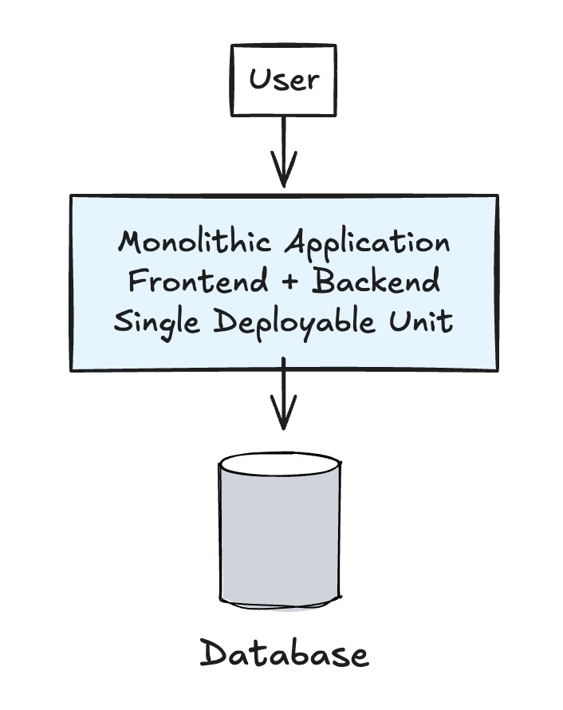

# Email Delivery Feature

## Detail

### Business Domain or Category

Customer Communication

### Project Description

A robust email delivery system that enables applications to send transactional, promotional, and notification emails to customers, clients, and users with reliable delivery tracking and management capabilities. (Traceability is optional here)

### Why

Modern applications require reliable email communication to engage users, send notifications, confirmations, and marketing content. A dedicated email delivery system ensures messages reach recipients while providing tracking, analytics, and delivery optimization.

### Variant

- Transactional email delivery
- Promotional email campaigns
- Notification email service
- Newsletter delivery
- Email template management

## Overall architecture

[Insert your overall architecture here]

## Possible Architecture

### 1. Simple Local Architecture

## Resources

- [Maildev](https://github.com/maildev/maildev) - For work locally, I suggest to use Maildev instead of actual one.
